# Procesverslag
Markdown is een simpele manier om HTML te schrijven.  
Markdown cheat cheet: [Hulp bij het schrijven van Markdown](https://github.com/adam-p/markdown-here/wiki/Markdown-Cheatsheet).

Nb. De standaardstructuur en de spartaanse opmaak van de README.md zijn helemaal prima. Het gaat om de inhoud van je procesverslag. Besteedt de tijd voor pracht en praal aan je website.

Nb. Door *open* toe te voegen aan een *details* element kun je deze standaard open zetten. Fijn om dat steeds voor de relevante stuk(ken) te doen.

## Jij

  
uitwerken voor kick-off werkgroep

  ### Auteur:
  Jannie Terpstra

  #### Je startniveau:
  Rode piste

  #### Je focus:
  Responsive
 

## Je website

  
uitwerken voor kick-off werkgroep

  ### Je opdracht:
  link naar de website die je gaat namaken óf de naam/omschrijving van je eigen ontwerp
  https://www.ekris.nl/bmw

  #### Screenshot(s) van de eerste pagina (small screen): 
  De BMW 7 serie

  https://www.ekris.nl/bmw/modellen/7-serie
  

  2024
   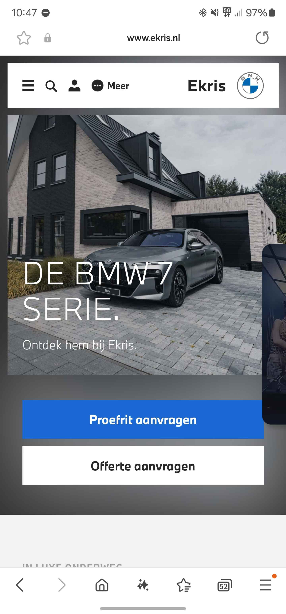

  #### Screenshot(s) van de tweede pagina (small screen):
  Fastr-verhalen

  https://www.ekris.nl/bmw/fastr/verhalen
  

  2024
  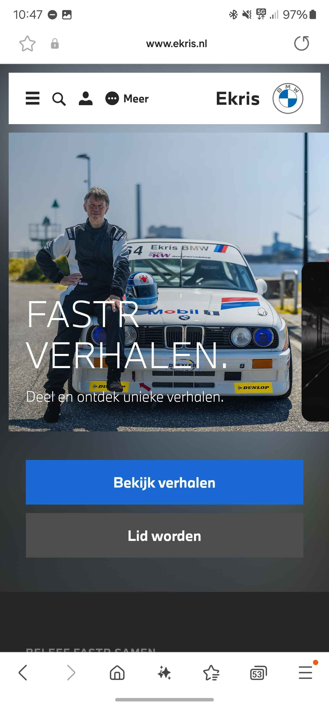
 

## README 2023 FED

## Toegankelijkheidstest 1/2 (week 1)

  
uitwerken na test in 2e werkgroep

  ### Bevindingen
  Lijst met je bevindingen die in de test naar voren kwamen:

  Overall is het mij opgevallen dat er veel tijd is gestopt in de reader ondanks dat de doelgroep niet direct blinde of slechtzienden zijn.
 
  Header:
  - De woorden worden compleet voorgelezen en daarnaast ook per letter.
  - Bij de ene wordt vermeld dat het een link is en bij de andere dat het een button is.
  - Via meer wordt er aangegeven dat de dialoog opent.
  - Het poppetje icoon wordt bij gezegd dat dit de link is naar het klant portal.
  - Via de knop meer wordt mij verteld dat dit de meer button is. Helaas wordt bij het icoon daarvan aangegeven dat de het een banner banner image is. 
  
  Pagina de BMW 7 serie:
  - Bij de BMW linkjes worden heeeeeel veel underscores genoemd. Pas op het einde wordt er aangegeven dat het een link is.
  - er staat veel tekst
  - De tekst is juist en er wordt gebruik gemaakt van headers.

  Pagina Fastr:
  - De afbeelding van de m3 is een underscore underscore heeeeel veel tekst... image.
  - Er staat in de tekst: stuur bericht naar dit email adres .... @mail. Er wordt niet gewerkt met een knop naar een formulier bijvoorbeeld.
  - Wil jij ook deel maken van? druk via de button. Welke button wordt niet over gesproken. Is de tekst een button? er had beter kunnen staan: druk hieronder zodat het duidelijk is dat je moet doorklikken. 

  Footer:
  - De onderste linkjes worden in het begin aangegeven dat het linkjes zijn.

  Foto's van WCAG checklist:

  

  
    
  
    
  
    
  
  

## Breakdownschets (week 1)

  
uitwerken na afloop 3e werkgroep

  ### de hele pagina: 
  

  ### dynamisch deel (bijv menu): 
  

  ### wellicht nog een dynamisch deel (bijv filter): 
  

## Voortgang 1 (week 2)

  
uitwerken voor 1e voortgang

  ### Stand van zaken
  - Maandags had ik de les gemist omdat er geen treinen reden en de omleiding voor mij onmogelijk was om naar de les te komen.
  - Ik heb gewerkt aan de 2 flexbox opdrachten. Ik heb gemerkt dat flexbox nog best lastig is en je niet te snel moet opgeven. 

  
    Ik heb een plan gemaakt wat ik graag wil bereiken deze week:
    1. Alle HTML van de 2 pagina's in een document
    2. Stuk voor stuk beginnen met de CSS

  ### Agenda voor meeting
  samen met je groepje opstellen:

  - ik zat in het groepje met Reanne. Eigenlijk kregen wij een soort van 1op1 begeleiding.
  Er waren niet mega veel studenten. Dat vond ik zeer prettig. 

  ### Verslag van meeting
  hier na afloop snel de uitkomsten van de meeting vastleggen

  - Ik moet nog best wat afbeeldingen in de site zetten
  - Ik heb mijn fonds gedownload met hulp, dit is gedowload zodat het al ingeladen wordt
    op mijn website. 
  - Ik heb uitleg gekregen over hoe ik om moet gaan met articles en sections.

  - 1 antwoord ben ik niet helemaal tevreden over. ik ben namelijk van mening     dat de titels 
    via uppercase van css moeten worden gestyled. Ik ga dit later bespreken met de docent. 
  - Ik heb de code opgesplits bij de h1, h2, h3 om niet te veel te herhalen. Dit was van mij een goed idee. 

## Voortgang 2 (week 3)

  
uitwerken voor 2e voortgang

  ### Stand van zaken
  Maandag is de les door omstandigheden niet door gegaan. Ik ben de maandag inhoudelijk niet doorgegaan met de stof van de les. Ik heb gewerkt aan mijn aanpassingen van de site omdat ik andere dingen aan mijn hoofd had. 

## Toegankelijkheidstest 2/2 (week 4)
tijdens deze les was ik niet aanwezig. 
ik zal deze test nogmaals moeten doen als ik bijna klaar ben met het afmaken van de site voor de herkansing

  
uitwerken na test in 9e werkgroep

  ### Bevindingen
  Lijst met je bevindingen die in de test naar voren kwamen (geef ook aan wat er verbeterd is):

## Voortgang 3 (week 4)

  
uitwerken voor 3e voortgang

  ### Stand van zaken
De fonds zijn juist gegaan. 

  ### Agenda voor meeting
1op1 hulp gekregen van de studentassistente , er is geen agenda opgemaakt wel had ik zelf een aantal punten wat ik wou bespreken:

 - hoe gebruik ik juist de selector voor css
 - ik heb problemen met mij veranderende plaatje van de veras mij auto kleur. hij veranderd namelijk de 1e afbeelding van de html pagina

  ### Verslag van meeting
  hier na afloop snel de uitkomsten van de meeting vastleggen

  - ik weet hoe ik de selector juist moet gebruiken en benoemen in de code
  - mijn afbeelding verander kleur werkt volledig op de pagina
  - ik heb gevraagd of ik voor buttons classes mag gebruiken ivm stijling
  - ivm stijling 2e pagina kan ik een class zetten op de body van de 2e pagina zodat ik niet verschillende classe hoef te gebruiken ivm stijling

## Eindgesprek (week 5)

  
uitwerken voor eindgesprek

  ### Je uitkomst - karakteristiek screenshots:
  

  ### Dit ging goed/Heb ik geleerd: 
 ik heb geleerd om fonts te downloaden en toe te voegen. 
 ik heb geleerd om styling per stuk te doen zonder classes
 Ik heb geleerd verschillende buttons te maken. 

  ### Dit was lastig/Is niet gelukt:
  alles volledig afronden .

## README 2024 FED

## Toegankelijkheidstest 1/2 (week 1)

  ### Bevindingen
  Ik heb mijn toegankelijkheidstest van 2023 meegenomen. Zie hierboven.  

## Breakdownschets (week 1)

  
uitwerken na afloop 3e werkgroep

- De website is het afgelopen half jaar niet veranderd op een afbeelding na. De basis blijft hetzelfde.
Zie info van 2023

## Voortgang 1 (week 2)

  
uitwerken voor 1e voortgang

  ### Stand van zaken
Ik heb deze week wat minder gedaan dan verwacht voor deze les. Ik ben meer orde gaan scheppen voor dat ik verder kan.
Ik heb zelf een planning vast gesteld waar ik mij de komende 2 weken echt op moet focussen:

- Achtergrond kleuren werken met de vlakken
- verdiepen in de klik drop down links daar zitten wel een aantal van in mijn side
- de afbeelding sliders werkend maken

  ### Agenda voor meeting
  samen met je groepje opstellen
  Geen agenda opgesteld. 

  ### Verslag van meeting
  hier na afloop snel de uitkomsten van de meeting vastleggen

  - Ik heb nog veel werk te doen naast de minor
  - tips gekregen voor de carocells. daar heb ik best veel van op mijn website
  - mijn lettertype is in de war. hij laad het bmw lettertype niet goed zien in de git hub. hij werkt wel in mijn eigen browser. de vet gedrukte lettertype werkt wel via de git. kwamen er niet helemaal uit met de studentassistentes. ze gaven wel tips waar ik mee verder kan om het uit te zoeken. 
  -

## Voortgang 2 (week 3)

  
uitwerken voor 2e voortgang

  ### Stand van zaken
  hier dit ging goed & dit was lastig (neem ook screenshots op van delen van je website en code)

  ### Agenda voor meeting
  samen met je groepje opstellen

- ik loop heel erg vast met de styling van mijn pagina's de margins en het feit dat alles blijft schalen en flexen
- ik moet meer tijd erin stoppen om uit te zoeken hoe dat werkt. 
- ik heb pop ups wat wordt er van mij verwacht
- het lettetype werkt nog niet juist. 

  ### Verslag van meeting
  hier na afloop snel de uitkomsten van de meeting vastleggen

  - meerdere richtlijnen gekregen voor mijn website met goede tips en handige links om voor een mooi en goed eind resultaat te komen. 
  - er is nog veel werk te doen aankomende week en daarnaast moet ik de toegankelijkheids test niet vergeten. 

## Toegankelijkheidstest 2/2 (week 4)

  
uitwerken na test in 9e werkgroep

  ### Bevindingen
  Lijst met je bevindingen die in de test naar voren kwamen (geef ook aan wat er verbeterd is):

  
  Foto's van WCAG checklist:

  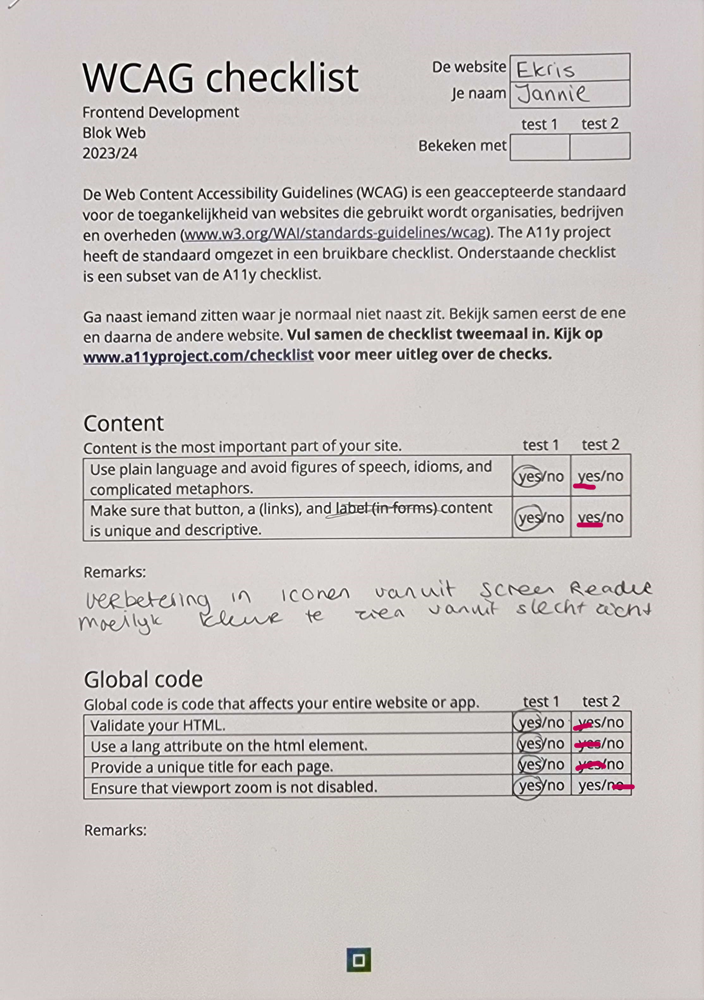

  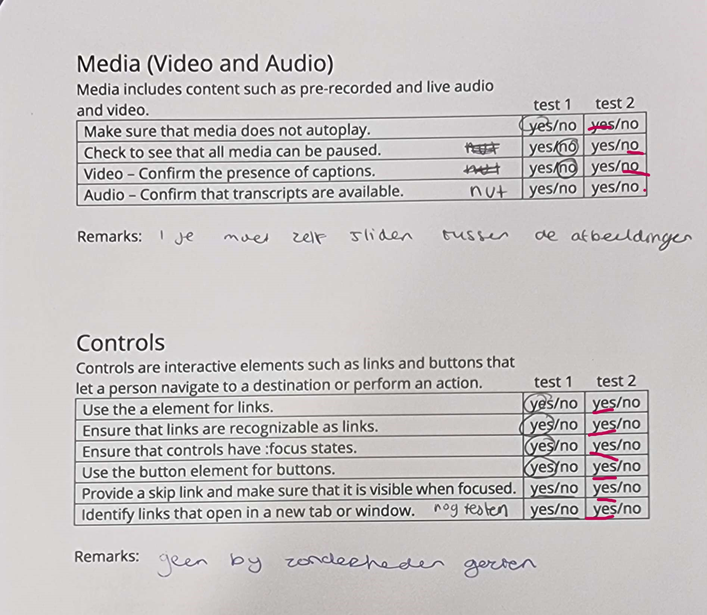
    
  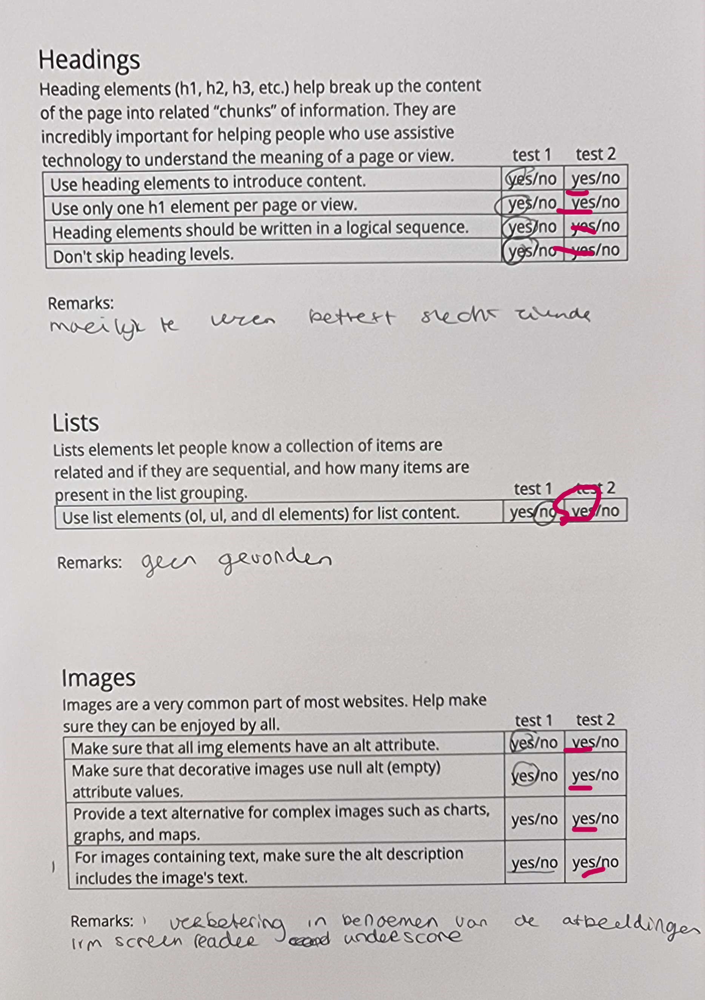
    
  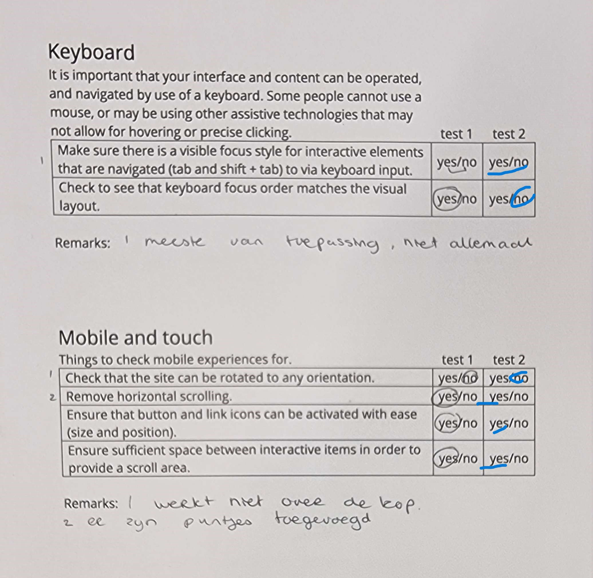
    
  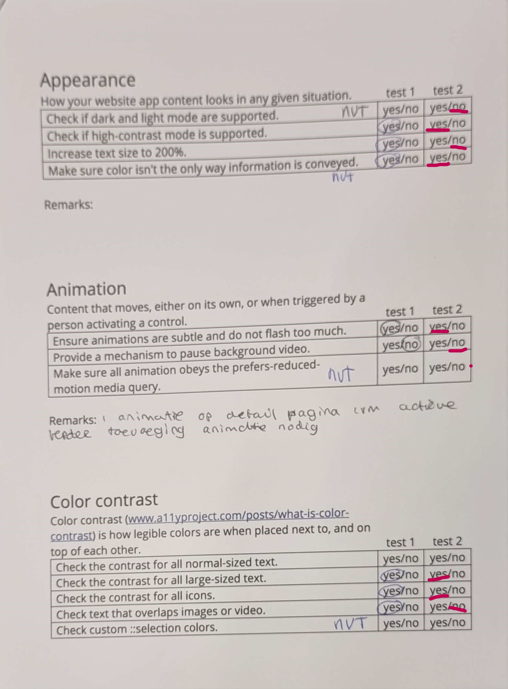
  

## Voortgang 3 (week 4)

  
uitwerken voor 3e voortgang

  ### Stand van zaken
  Ik moet nog meer doen dan ik besefte eigenlijk ik moet de komende dagen nog vol aan de code werken het valt mij tegen hoeveel
  tijd ik nog heb naast de Minor wat in groepsopdracht gaat. 
  

  ### Verslag van meeting
  hier na afloop snel de uitkomsten van de meeting vastleggen

  - de carrocels werken nog niet op alle verschillende standen 
  - tips gekregen om de afbeeldingen te positioneren

## Eindgesprek (week 5)

  
uitwerken voor eindgesprek

  ### Je uitkomst - karakteristiek screenshots:
  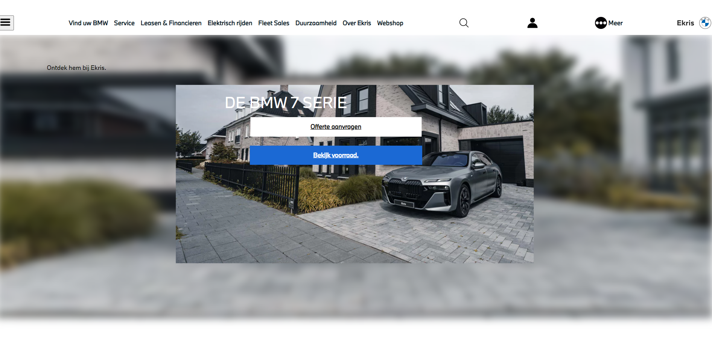

  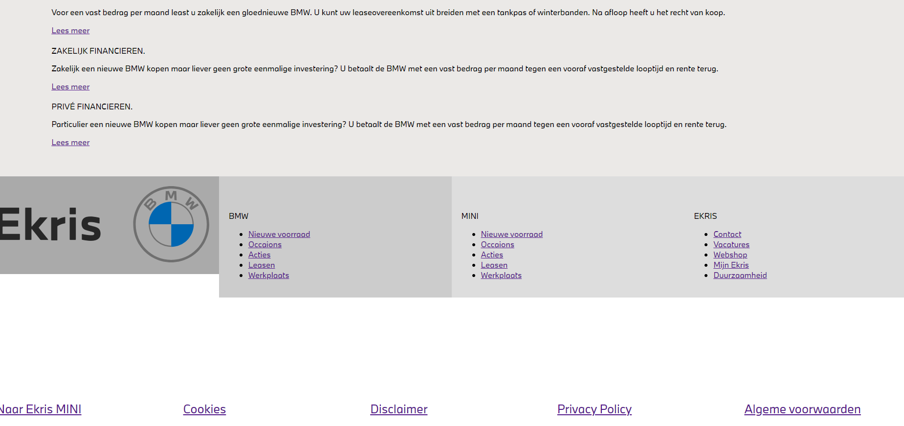

  ### Dit ging goed/Heb ik geleerd: 
  Korte omschrijving met plaatjes

  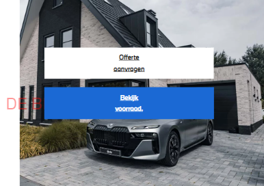

  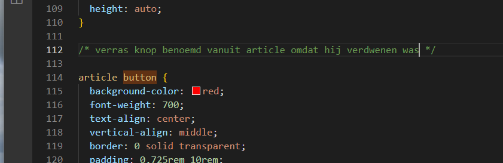

  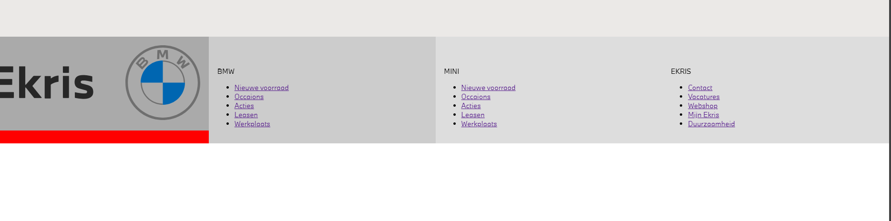

  ### Dit was lastig/Is niet gelukt:
  Korte omschrijving met plaatjes

  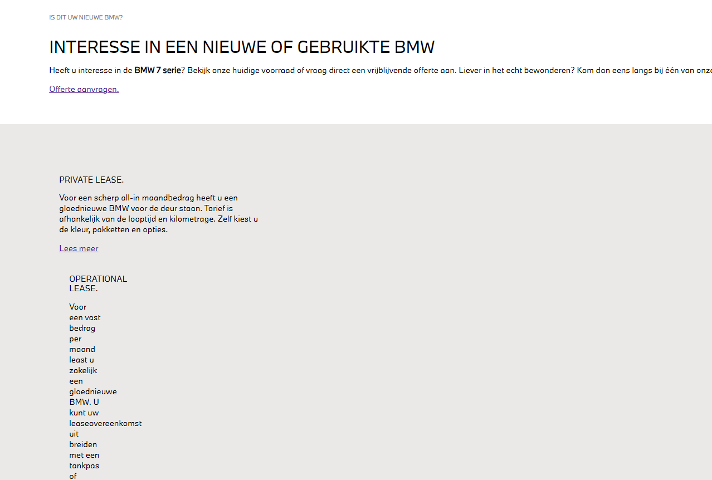

  
deel van de algehele styling en overzicht maken

## Aanpassingen na eindgesprek (herkansing)

## Bronnenlijst

  
continu bijhouden terwijl je werkt

  Nb. Wees specifiek ('css-tricks' als bron is bijv. niet specifiek genoeg). 
  Nb. ChatGpT en andere AI horen er ook bij.
  Nb. Vermeld de bronnen ook in je code.

1. https://developer.mozilla.org/en-US/docs/Web/CSS/:last-of-type

2. https://stackoverflow.com/questions/44172360/github-pages-font-face-not-working

3. Carrousels code https://codepen.io/shooft/pen/yLKjzWa

4. Afbeelding blur https://developer.mozilla.org/en-US/docs/Web/CSS/filter-function/blur

5. Afbeelding laten vervangen https://developer.mozilla.org/en-US/docs/Learn/HTML/Multimedia_and_embedding/Responsive_images

6. z index afbeeldingen voor https://developer.mozilla.org/en-US/docs/Web/CSS/z-index

7. tooltip pop up https://blog.logrocket.com/creating-beautiful-tooltips-with-only-css/

8. gridd https://codepen.io/rachelandrew/pen/dpYzZq?editors=1100

9. https://www.w3schools.com/css/tryit.asp?filename=trycss_mediaqueries_ex2

10. https://chatgpt.com/share/66f8bc06-4bd0-8012-ae29-b51d49013bc0 chat gpt gevraagd om mijn java script in te korten. na kopieeren van 
alles van het voorbeeld kwam ik na vergelijken er niet meer uit wat wel en niet nodig was. elke keer werkte de code daardoor niet. 
hierom het in laten korten. 

11. Tips van de studentassistenten en docent Danny 

